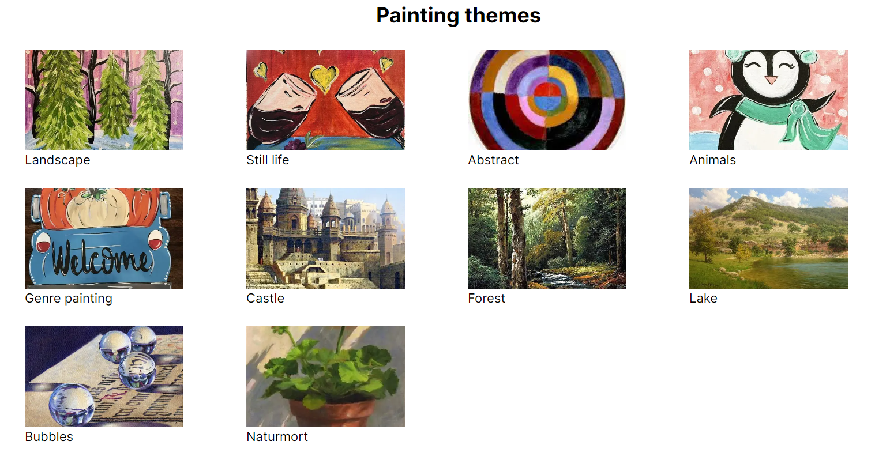
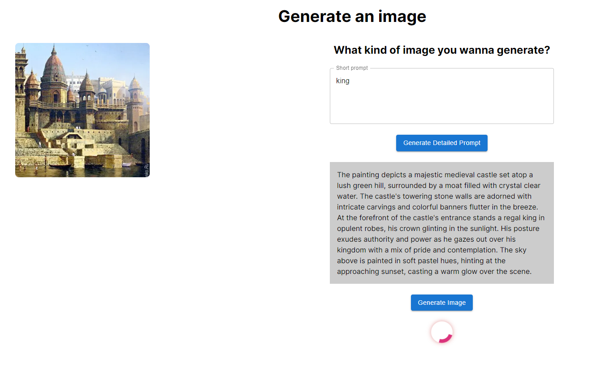
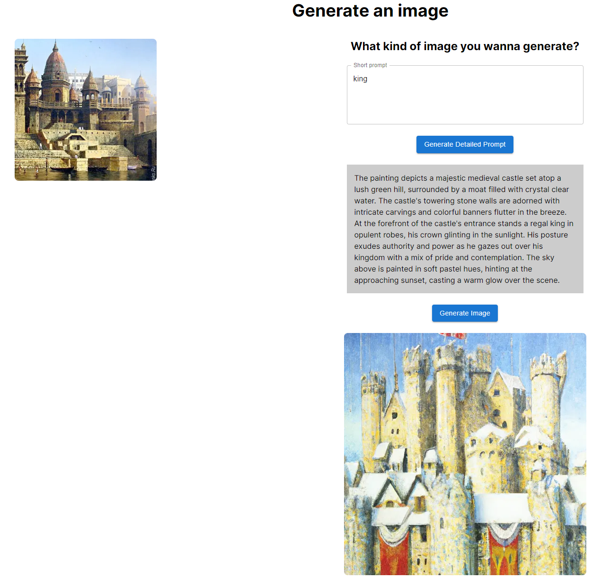

# Image Generator

## Team 31:
Akezh - KhYtRG
Tasin Hoque - YuGfro
Ksenia - TK25ZS
Meryem Afife — rgwO9w
InaamGPT - INq0jL

## Specification

1. Create a new application from scratch using NextJS
2. Create an assistant in OpenAI that composes descriptions of paintings

   - The assistant should be able to suggest and describe the details of a painting based on a short description from the user

3. Configure the assistant prompt to be efficient at answering strictly painting descriptions with details about its elements, style, details, and colors
4. Create a page for the user to pick an option from a selection of painting themes
5. Include a button to send a message to the assistant for it to generate a painting description with the selected theme

   - Use the OpenAI [Assistants API](https://platform.openai.com/docs/assistants/overview) to create threads and messages for the assistant

6. When the assistant answers, display the generated text output in a text box
7. Create a button for the user to request the image to be generated based on the content of the text box
8. Create a short form after the button for the user to choose the image generation parameters
9. Include a button to request the image to be generated
10. Ask the Image Generation API to generate the image
11. Display a loader while the image is being generated
12. Display the image in the page when it is generated

## Environment Setup

Create a ChatGPT assistant with the name "Prompt Generator" and instructions:

```txt
You are a prompt generator. You will assist users to write detailed prompts for image generation purposes. The user will provide a short description of the painting they would like to generate. This description can include details such as the setting, objects, colors, mood, style, and any other specific elements they want to see in the painting. You will respond with a complete painting description. Your message must be less than 1000 characters. 
```

Copy the ID of the assistant and put it in `.env` (place this file in the root directory). Example `.env`:

```txt
ASSISTANT_ID=asst_5AOh7RJy6JQFAju216OcIG4B
```

Fill your API key in `.env`:

```txt
OPENAI_API_KEY=
```

## Getting Started

This is a [Next.js](https://nextjs.org/) project bootstrapped with [`create-next-app`](https://github.com/vercel/next.js/tree/canary/packages/create-next-app).

First, install all project dependancies:

```bash
npm install
```

And run the development server:

```bash
npm run dev
```

Open [http://localhost:3000](http://localhost:3000) with your browser to see the result.

You can start editing the page by modifying `app/page.tsx`. The page auto-updates as you edit the file.

This project uses [`next/font`](https://nextjs.org/docs/basic-features/font-optimization) to automatically optimize and load Inter, a custom Google Font.

## Features

Layouts



Image Loading



Generated Image


